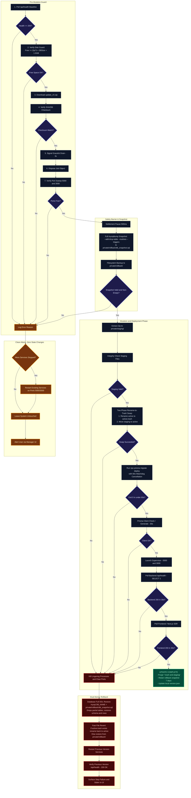

# Update Flow

Update and rollback flow: pre-mutation guard, snapshot, deployment, clean abort, and dual atomic rollback.

```mermaid
flowchart TD
    classDef action fill:#0f172a,stroke:#64748b,stroke-width:1px,color:#e2e8f0;
    classDef decision fill:#1e1b4b,stroke:#818cf8,stroke-width:2px,color:#e0e7ff;
    classDef abort fill:#78350f,stroke:#f59e0b,stroke-width:2px,color:#fef3c7;
    classDef rollback fill:#450a0a,stroke:#ef4444,stroke-width:2px,color:#fecaca;
    classDef success fill:#064e3b,stroke:#10b981,stroke-width:2px,color:#a7f3d0;

    subgraph PRE_MUTATION ["Pre-Mutation Guard"]
        A1["1. Poll /api/health Baseline"]:::action --> A2{"Health == 200?"}:::decision
        A2 -- No --> AB1
        A2 -- Yes --> A3["2. Verify Disk Guard:<br/>Free >= Zip*3 + DBSize + 1.5GB"]:::action
        A3 --> A4{"Free Space OK?"}:::decision
        A4 -- No --> AB1
        A4 -- Yes --> A5["3. Download update_vX.zip"]:::action
        A5 --> A6["4. Verify SHA256 Checksum"]:::action
        A6 --> A7{"Checksum Match?"}:::decision
        A7 -- No --> AB1
        A7 -- Yes --> B1["5. Signal Graceful Drain - 3s"]:::action
        B1 --> B2["6. Dispose Job Object"]:::action
        B2 --> B3["7. Verify Port Sweep 5000 and 3000"]:::action
        B3 --> B4{"Ports Free?"}:::decision
        B4 -- No --> AB1
    end

    subgraph SNAPSHOT ["Safety Barrier & Snapshot"]
        B4 -- Yes --> C1["Settlement Pause 500ms"]:::action
        C1 --> C2["Full mysqldump Snapshot:<br/>--add-drop-table --routines --triggers<br/>to private/rollback/db_snapshot.sql"]:::action
        C2 --> C3["Filesystem Backup to private/rollback/"]:::action
        C3 --> C4{"Snapshot Valid and Non-Empty?"}:::decision
        C4 -- No --> AB1
    end

    subgraph POST_MUTATION ["Mutation and Deployment Phase"]
        C4 -- Yes --> D1["Extract Zip to private/staging/"]:::action
        D1 --> D2["Integrity Check Staging Files"]:::action
        D2 --> D3{"Staging Valid?"}:::decision
        D3 -- No --> R1
        D3 -- Yes --> D4["Two-Phase Rename-to-Trash Swap:<br/>1. Rename active to active.trash<br/>2. Move staging to active"]:::action
        D4 --> D5{"Swap Succeeded?"}:::decision
        D5 -- No --> R1
        D5 -- Yes --> E1["Run npx prisma migrate deploy<br/>with 60s Watchdog Cancellation"]:::action
        E1 --> E2{"Exit 0 in under 60s?"}:::decision
        E2 -- No --> R1
        E2 -- Yes --> F1["Prisma Client Check / Generate - 30s"]:::action
        F1 --> F2{"Client OK?"}:::decision
        F2 -- No --> R1
        F2 -- Yes --> G1["Launch Supervisor - 5000 and 3000"]:::action
        G1 --> G2["Poll Backend /api/health - SELECT 1"]:::action
        G2 --> G3{"Backend 200 in 30s?"}:::decision
        G3 -- No --> R1
        G3 -- Yes --> G4["Poll Frontend / Next.js SSR"]:::action
        G4 --> G5{"Frontend 200 in 30s?"}:::decision
        G5 -- No --> R1
        G5 -- Yes --> SUCCESS_BRANCH["UPDATE COMPLETE<br/>- Purge *.trash and staging/<br/>- Retain rollback snapshot 7 days<br/>- Update local version.json"]:::success
    end

    subgraph ABORT_BRANCH ["Clean Abort - Zero State Changes"]
        AB1["Log Error Reason"]:::abort --> AB2{"Were Services Stopped?"}:::abort
        AB2 -- Yes --> AB3["Restart Existing Services on Ports 5000/3000"]:::abort
        AB2 -- No --> AB4["Leave System Untouched"]:::abort
        AB3 --> AB4
        AB4 --> AB_END["Alert User via Manager UI"]:::abort
    end

    subgraph ROLLBACK_BRANCH ["Dual Atomic Rollback"]
        R1["Kill Lingering Processes and Clear Ports"]:::rollback --> R2["Database Full DDL Restore:<br/>mysql DB_NAME #lt; private/rollback/db_snapshot.sql<br/>Drops partial tables, restores schema and rows"]:::rollback
        R2 --> R3["Fast File Revert:<br/>If active.trash exists rename back to active<br/>Else restore from private/rollback/"]:::rollback
        R3 --> R4["Restart Previous Version Services"]:::rollback
        R4 --> R5["Verify Previous Version /api/health - 200 OK"]:::rollback
        R5 --> R_END["Surface Step Failure and Stderr in UI"]:::rollback
    end
```
